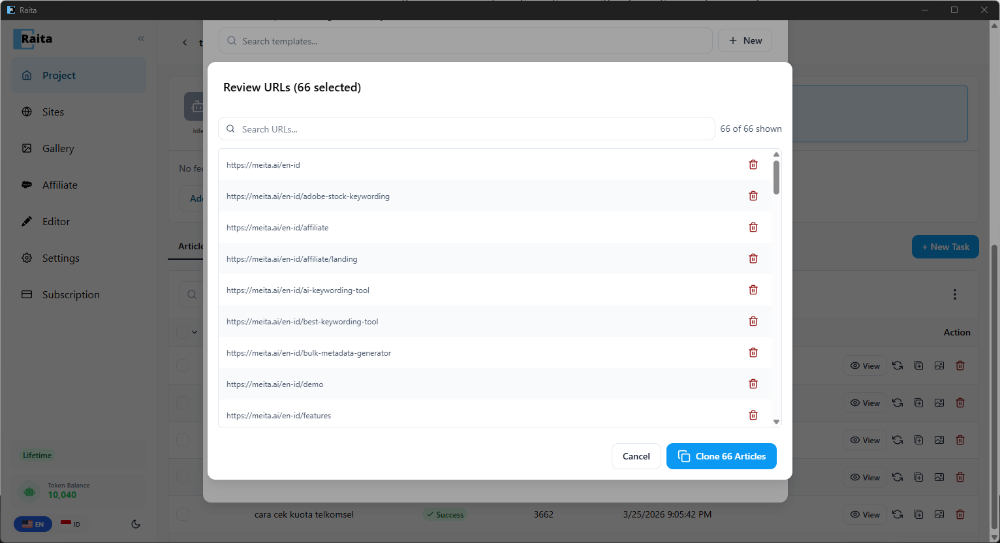

Clone Bot memungkinkan Anda mengkloning konten seluruh situs web dengan membaca sitemapnya dan membuat artikel baru berdasarkan URL tersebut — menggunakan template prompt pilihan Anda.

**Use case:** Anda ingin mengkloning daftar artikel situs Anda yang lain ke domain baru, atau mereplikasi cakupan topik pesaing dengan artikel unik Anda sendiri.

---

## Cara Menggunakan Clone Bot

1. Masukkan **Sitemap URL atau Domain** (contoh: `meita.ai/sitemap.xml`) dan klik **Check** — Raita mengambil dan mem-parse semua URL artikel
2. Atur **Date Threshold** untuk memfilter berdasarkan kesegaran (contoh: "Last 1 year") dan pilih cara mengekstrak **Title & Keyword** dari URL
3. Pilih apa yang terjadi **After generation** — simpan sebagai draft atau publikasikan secara langsung
4. Secara opsional atur **AI Filter** untuk melewati URL yang tidak relevan (contoh: "Only clone articles about React tutorials. Skip news roundups.")
5. Pilih **Generation Prompt** — pilih template starter (Simple V4, Blaze V4, Compose V4) atau konfigurasikan secara manual
6. Klik **Clone Article**

---

## Meninjau URL

Setelah mengklik **Clone Article**, Raita menampilkan daftar semua URL yang cocok. Tinjau daftarnya dan hapus URL apa pun yang tidak ingin Anda kloning (contoh: halaman landing, halaman harga, konten non-artikel) dengan mengklik ikon hapus di samping setiap URL.

Saat siap, klik **Clone Articles** untuk memulai pembuatan.

---

## Opsi Konfigurasi

| Opsi | Deskripsi |
|---|---|
| **Sitemap URL / Domain** | Sitemap sumber atau domain untuk dipindai artikel |
| **Date Threshold** | Hanya sertakan artikel yang diterbitkan dalam periode ini |
| **Title & Keyword** | Cara mengekstrak judul artikel — tulis ulang dari slug, gunakan judul halaman, dll. |
| **After generation** | Simpan sebagai draft atau publikasikan otomatis ke situs WordPress yang terhubung |
| **AI Filter** | Prompt opsional untuk mengevaluasi setiap URL — AI memutuskan mana yang harus dimasukkan |
| **Generation Prompt** | Template prompt untuk digunakan untuk membuat artikel yang dikloning |

---

## Catatan

- Worker yang dibuat oleh Clone Bot identik dengan worker yang dibuat secara manual — mereka muncul di tabel yang sama dan dapat dicoba ulang, diedit, atau diekspor
- Jika tidak ada template yang dilampirkan, worker menggunakan prompt mode Simple default proyek
- Daftar URL besar (100+) mungkin memerlukan waktu untuk antri — antrian memproses worker sesuai dengan pengaturan batch-per-run di Settings
- Kemajuan batch dilacak dan ditampilkan sampai semua worker dibuat
