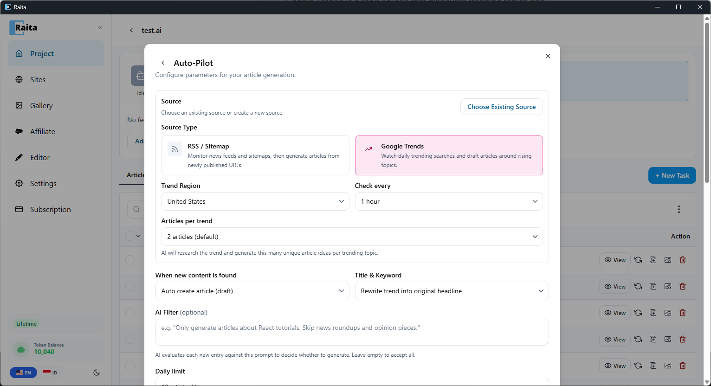
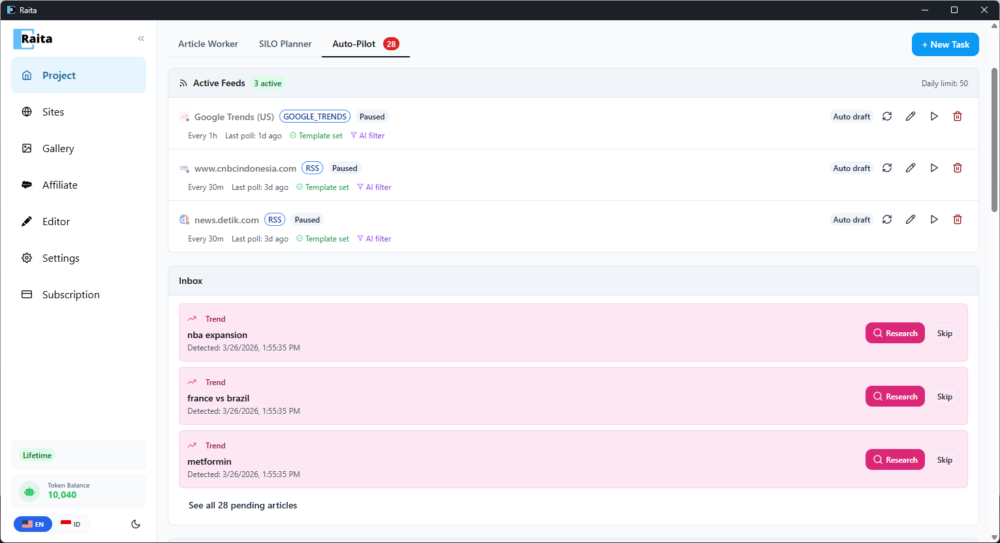
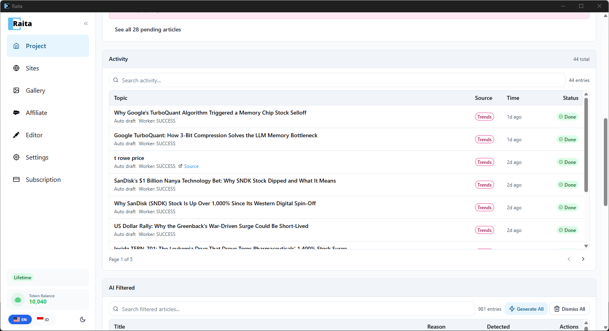

Google Trends adalah sumber feed yang tersedia di [Auto-Pilot](auto-pilot.md) yang menemukan topik trending dan secara otomatis mengubahnya menjadi artikel workers.

Tidak seperti feed RSS, Google Trends menarik topik pencarian trending dari Google, secara opsional menyaringnya berdasarkan relevansi menggunakan AI, dan membuat artikel dari ide yang diteliti.

---

## Penyiapan

Google Trends dikonfigurasi sebagai sumber Auto-Pilot. Buka proyek Anda, klik tab **Auto-Pilot**, dan buat sumber baru dengan **Google Trends** dipilih.

1. Atur **Trend Region** — pilih negara untuk dipantau (contoh: United States, Indonesia)
2. Atur **Check every** — seberapa sering polling tren baru (contoh: setiap 1 jam)
3. Atur **Articles per trend** — berapa banyak ide artikel unik AI buat per topik trending (default: 2)
4. Pilih **When new content is found** — auto-buat sebagai draft, publikasikan otomatis, atau tinjauan manual
5. Atur **AI Filter** (opsional) — prompt untuk hanya menerima trends yang cocok dengan niche Anda (contoh: "Only generate articles about coffee")
6. Pilih **Generation Prompt** — pilih template starter atau konfigurasikan secara manual
7. Klik **Generate**

---

## Feed Aktif & Inbox

Setelah dikonfigurasi, Google Trends muncul sebagai feed aktif di tab Auto-Pilot bersama dengan feed RSS/Sitemap apa pun. Raita poll tren baru pada jadwal yang Anda konfigurasikan.

Ketika kebijakan diatur ke tinjauan manual, atau ketika AI tidak yakin tentang relevansi trend, trends masuk ke **Inbox**:

- **Research** — AI meneliti trend menggunakan pencarian web dan membuat beberapa ide artikel unik. Ini kemudian antri sebagai Article Workers.
- **Skip** — abaikan trend jika tidak cocok dengan niche Anda

Untuk sumber auto-draft atau auto-publish, artikel dibuat secara otomatis tanpa muncul di inbox.

---

## Activity Log

Artikel yang dibuat muncul di tabel **Article Worker** biasa dan log **Activity** di tab Auto-Pilot. Setiap entry menampilkan topik artikel, sumber (Trends), waktu, dan status.

---

## AI Filtered

Trends yang ditolak oleh filter AI Anda muncul di bagian **AI Filtered** dengan alasan penolakan (contoh: "sports news, not investment"). Anda masih dapat **Research** mereka untuk mengatasi filter, atau **Dismiss** mereka secara permanen.

---

## Catatan

- Google Trends tidak memerlukan API key — menggunakan data trending publik
- Ide artikel dibuat menggunakan AI dengan pencarian web diaktifkan, jadi mereka diperkaya secara kontekstual
- Topik trend berumur pendek dan secara otomatis dibersihkan setelah 3 hari
- Setiap trend dapat membuat beberapa ide artikel (dapat dikonfigurasi via "Articles per trend")
- Trends adalah spesifik wilayah — pilih wilayah di mana audiens Anda berada
