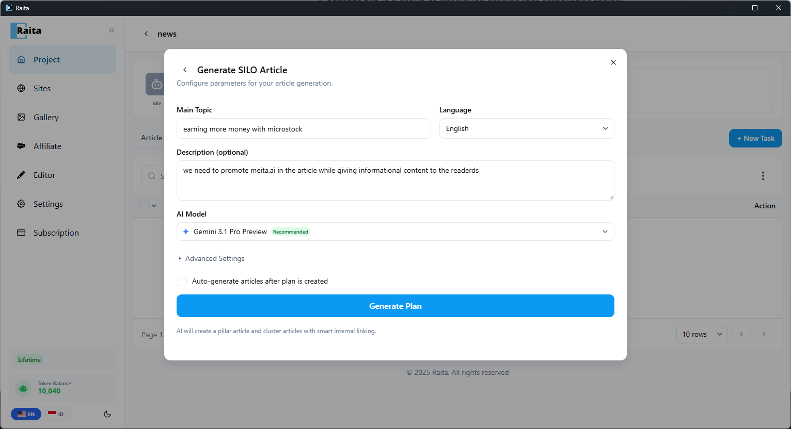
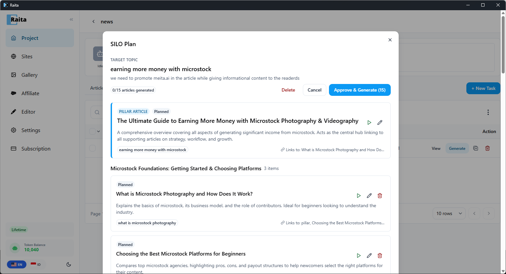

Sebuah **content silo** adalah kelompok artikel yang saling terhubung yang menetapkan otoritas topikal: satu halaman pilar mencakup topik yang luas, dan beberapa halaman pendukung mencakup subtopik spesifik — semuanya saling terhubung.

SILO Planner membuat rencana konten untuk silo Anda secara otomatis, kemudian membuat Article Workers untuk setiap halaman dalam rencana.

---

## Membuat Rencana SILO

1. Buka proyek Anda dan klik tab **SILO Planner**
2. Klik **New Plan**
3. Masukkan **Main Topic** (contoh: "earning more money with microstock")
4. Pilih **Language** untuk rencana yang dibuat
5. Secara opsional tambahkan **Description** untuk membimbing AI (contoh: "we need to promote meita.ai in the article while giving informational content to the readers")
6. Pilih **AI Model** — Gemini 3.1 Pro Preview direkomendasikan
7. Secara opsional centang **Auto-generate articles after plan is created** untuk segera mulai membuat worker
8. Klik **Generate Plan**

AI akan membuat artikel pilar dan artikel cluster dengan linking internal yang cerdas.

---

## Meninjau & Membuat Rencana

Setelah pembuatan, klik rencana untuk membuka tampilan detail. Anda akan melihat:

- **Target topic** dan deskripsi di bagian atas
- Penghitung kemajuan (contoh: "0/15 articles generated")
- **Pillar Article** — halaman hub pusat yang menghubungkan ke semua artikel pendukung
- **Cluster groups** — artikel pendukung yang diorganisir berdasarkan subtopik, masing-masing dengan judul, deskripsi, kata kunci, dan target link internal

Setiap kartu artikel menampilkan:
- **Status** (Planned, Generating, Done)
- **Keyword** yang digunakan untuk pembuatan
- **Links to** — artikel mana dalam silo yang akan ditautkan
- Tombol aksi untuk **play** (buat secara individual), **edit**, atau **delete**

Saat siap, klik **Approve & Generate** untuk membuat Article Workers untuk semua artikel yang direncanakan sekaligus. Anda juga dapat **Delete** rencana atau **Cancel**.

---

## Pengaturan Lanjutan

Perluas **Advanced Settings** dalam formulir untuk menyempurnakan:
- Jumlah artikel cluster yang akan dibuat
- Template prompt kustom untuk worker yang dibuat

Jika tidak ada template yang dilampirkan, worker menggunakan pengaturan prompt default proyek.
