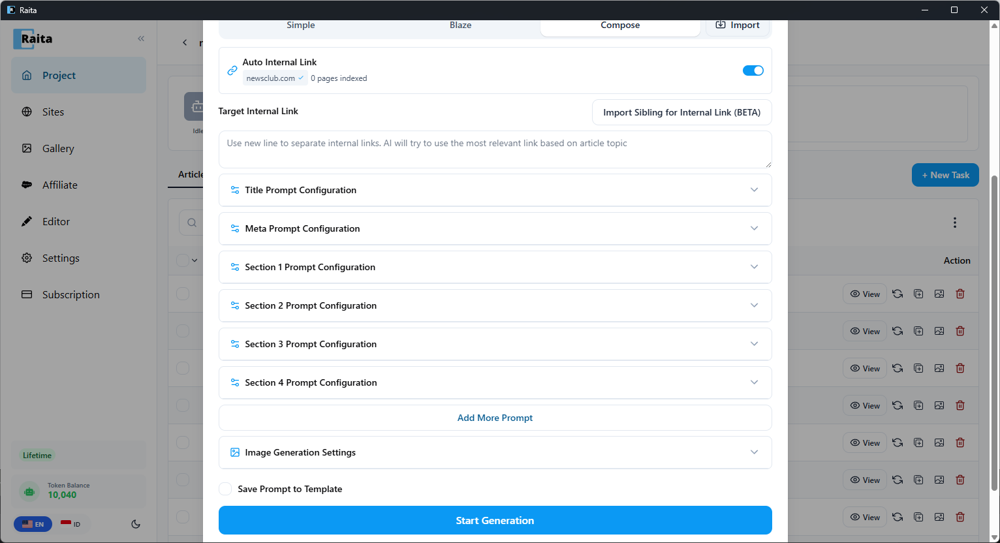

Mode Compose membuat artikel sebagai serangkaian **bagian independen**, kemudian menggabungkannya dengan string pemisah. Anda mendefinisikan setiap bagian dengan promptnya sendiri.

**Terbaik untuk:**
- Artikel di mana setiap bagian memiliki tujuan atau format yang berbeda
- Konten long-form di mana Anda menginginkan tone/gaya berbeda per bagian
- Konten berurutan di mana setiap bagian membangun dari yang sebelumnya (gunakan `{chain}`)

---

## Template Starter

Raita dilengkapi dengan template Compose siap pakai sehingga Anda dapat mulai membuat segera:


| Template | Deskripsi |
|---|---|
| **Compose V4** | ~4.000+ kata. Pembuatan multi-bagian berantai untuk konten long-form. |
| **Compose V4 + AI Image** | ~4.000+ kata. Pembuatan multi-bagian berantai dengan pembuatan gambar AI. |

Untuk menggunakan template starter, klik **+ New Task**, kemudian pilih template dari pemilih template. Semua prompt bagian sudah dikonfigurasi — cukup masukkan kata kunci dan buat.

---

## Konfigurasi

Dalam formulir New Task, pilih tab **Compose**.



---

## Bidang

### Prompt Judul (opsional)

Membuat judul artikel. Jika dibiarkan kosong, topik digunakan sebagai judul.

### Prompt Meta (opsional)

Membuat deskripsi meta HTML.

### Contents

Daftar bagian utama. Setiap entry adalah satu prompt dengan teks prompt, suhu, dan model sendiri.

Tambahkan bagian dengan **+ Add Section**. Setiap bagian dibuat secara independen secara default.

Output dari semua bagian digabungkan dengan **Glue String** untuk membentuk artikel akhir.

Contoh daftar contents untuk artikel review produk:
- Bagian 1: `Write an introduction for a review of {topic}. HTML, 1-2 paragraphs.`
- Bagian 2: `Write a "Key Features" section for {topic}. HTML with bullet points.`
- Bagian 3: `Write a "Pros and Cons" section for {topic}. HTML table format.`
- Bagian 4: `Write a conclusion and recommendation for {topic}. HTML, 1 paragraph.`

### Glue String

String yang disisipkan antara setiap bagian yang dibuat. Default adalah string kosong (bagian digabungkan secara langsung). Nilai umum:
- `\n\n` — dua baris baru
- `<hr>` — garis horizontal
- `<!-- section-break -->` — pemisah komentar

### Internal Link Target

Daftar URL atau URL sitemap untuk digunakan untuk injeksi link internal. Lihat [Using Internal Links](../site-intelligence/internal-links.md).

---

## Pembuatan Paralel vs Berantai

Secara default, semua bagian dibuat **secara paralel** — setiap prompt bagian berjalan secara bersamaan.

Jika **salah satu** prompt bagian berisi `{chain}`, seluruh artikel beralih ke **pembuatan berurutan (berantai)**:
- Bagian berjalan satu per satu, sesuai urutan
- Setiap bagian menerima output yang digabungkan dari semua bagian sebelumnya sebagai `{chain}`
- Gunakan ini ketika bagian-bagian nanti perlu mereferensikan konten awal

Contoh prompt berantai:
```
Continue the article. So far: {chain}

Now write the "Advanced Tips" section for {topic}. HTML format, 300 words.
```

---

## Variabel Tersedia

| Variabel | Deskripsi |
|---|---|
| `{topic}`, `{keyword}`, `{niche}`, `{language}` | Variabel standar |
| `{title}` | Judul yang dibuat (jika prompt judul dikonfigurasi) |
| `{index}` | Indeks bagian (berbasis 0) |
| `{internalLink}` | Satu link internal (dari daftar target) |
| `{random5InternalLink}` | 5 link internal yang dipilih secara acak |
| `{chain}` | Semua bagian yang dibuat sebelumnya (hanya mode berantai) |

Lihat [Referensi Prompt Variables](../reference/prompt-variables.md).
