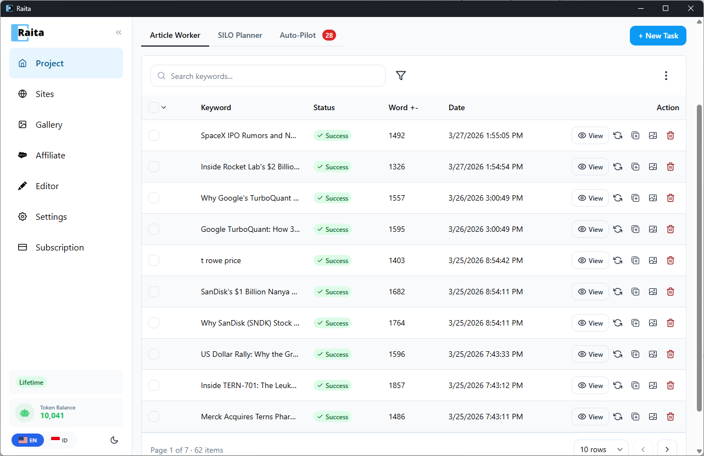

## Proyek

Sebuah **proyek** adalah wadah untuk sekelompok article workers yang terkait. Bayangkan itu sebagai folder untuk satu situs web atau kampanye konten.

Setiap proyek memiliki:
- Nama
- Niche (digunakan sebagai variabel default `{niche}` dalam prompt)
- Bahasa (digunakan sebagai variabel default `{language}`)

---

## Article Workers

Sebuah **Article Worker** adalah satu pekerjaan pembuatan artikel. Setiap worker memiliki:
- **Topik** — subjek artikel
- **Mode pembuatan** — Simple, Blaze, atau Compose
- **Konfigurasi prompt** — prompt dan pengaturan untuk mode itu
- **Status** — state saat ini worker

---

## Siklus Hidup Worker

Worker bergerak melalui status-status ini:

| Status | Arti |
|---|---|
| **Pending** | Antri, menunggu untuk dijalankan |
| **Running** | Sedang membuat |
| **Done** | Pembuatan selesai, artikel tersedia |
| **Failed** | Pembuatan gagal (lihat error di hasil) |
| **Paused** | Dijeda secara manual |

---

## Tabel Worker

Tampilan utama proyek adalah tabel dari semua workernya. Dari sini Anda dapat:

- **Klik baris** untuk melihat artikel yang dibuat
- **Pilih baris** menggunakan checkbox untuk aksi massal
- **Filter** berdasarkan status, tanggal, atau kata kunci
- **Aksi massal**: coba ulang worker yang gagal, hapus worker, ekspor artikel yang dipilih

---

## Membuat Worker

Klik **New Task** untuk membuka formulir pembuatan worker. Lihat [Simple Mode](simple-mode.md), [Blaze Mode](blaze-mode.md), atau [Compose Mode](compose-mode.md) untuk instruksi detail tentang setiap mode pembuatan.

---

## Mengimpor Workers

Anda dapat mengimpor worker secara massal dari file CSV atau XLSX yang berisi daftar topik. Buka tombol **Import** di header proyek.

Setiap baris di file Anda menjadi satu worker. File harus memiliki minimal kolom `topic`. Secara opsional sertakan `niche`, `language`, dan bidang prompt.
