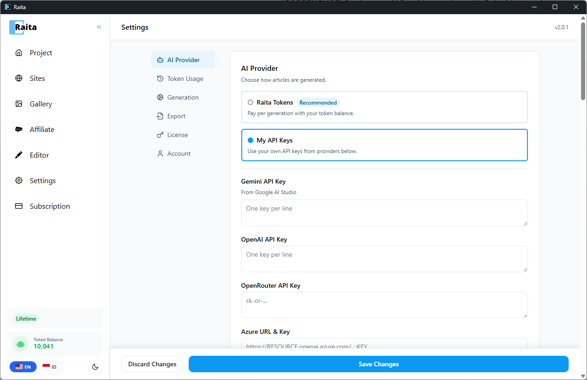

Raita mendukung dua cara menjalankan pembuatan artikel:

| Mode | Cara Kerja | Terbaik untuk |
|---|---|---|
| **Raita Terkelola** | Menggunakan pipeline cloud Raita, ditagih dalam token Raita | Memulai dengan cepat, tidak perlu akun API |
| **BYOK (Bawa Kunci Anda Sendiri)** | Memanggil penyedia AI secara langsung menggunakan kunci API Anda | Kontrol penuh, gunakan kuota API Anda sendiri |

---

## Menyiapkan Raita Terkelola

1. Buka **Pengaturan** → **Penyedia AI**
2. Pilih **Raita** sebagai sumber AI
3. Pastikan Anda memiliki token di dompet Anda (lihat [Setup Akun](account-setup.md))
4. Klik **Simpan**

---

## Menyiapkan BYOK

### OpenAI

1. Dapatkan kunci API dari [platform.openai.com](https://platform.openai.com)
2. Di Pengaturan Raita → **Penyedia AI**, pilih **OpenAI**
3. Tempel kunci Anda ke kolom **Kunci API OpenAI**
4. Klik **Simpan**

Model yang tersedia termasuk GPT-4o, GPT-4o-mini, GPT-4.1, GPT-4.1 Mini. Pencarian web didukung melalui alat pencarian web OpenAI.

### Google Gemini

1. Dapatkan kunci API dari [aistudio.google.com](https://aistudio.google.com)
2. Pilih **Gemini** di pengaturan Penyedia AI
3. Tempel kunci Anda ke kolom **Kunci API Gemini**
4. Klik **Simpan**

Model yang tersedia termasuk Gemini 1.5 Pro, Gemini 1.5 Flash, Gemini 2.0 Flash. Grounding (pencarian web) didukung.

### Azure OpenAI

1. Buat sumber daya Azure OpenAI di portal Azure
2. Terapkan model (mis. `gpt-4o`)
3. Di Pengaturan Raita, pilih **Azure**
4. Masukkan **URL Endpoint**, **Kunci API**, dan **Nama Deployment** Azure Anda
5. Klik **Simpan**

### OpenRouter

1. Dapatkan kunci API dari [openrouter.ai](https://openrouter.ai)
2. Pilih **OpenRouter** di pengaturan Penyedia AI
3. Tempel kunci Anda ke kolom **Kunci API OpenRouter**
4. Klik **Simpan**

OpenRouter memberikan akses ke banyak model dari penyedia berbeda melalui satu kunci.

### Titik Akhir Kustom

Untuk API kompatibel OpenAI apa pun (model lokal melalui Ollama, LM Studio, dll.):
1. Pilih **Kustom** di pengaturan Penyedia AI
2. Masukkan **URL Dasar** titik akhir Anda (mis. `http://localhost:11434/v1`)
3. Masukkan kunci API jika titik akhir Anda memerlukan satu
4. Klik **Simpan**
