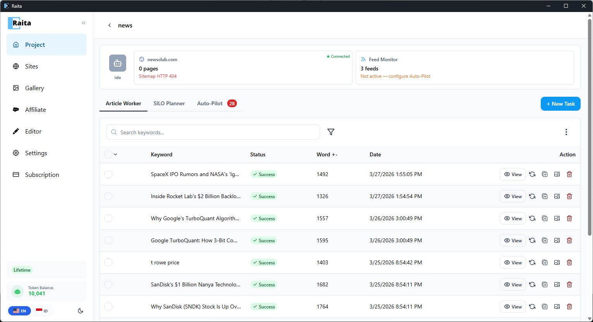
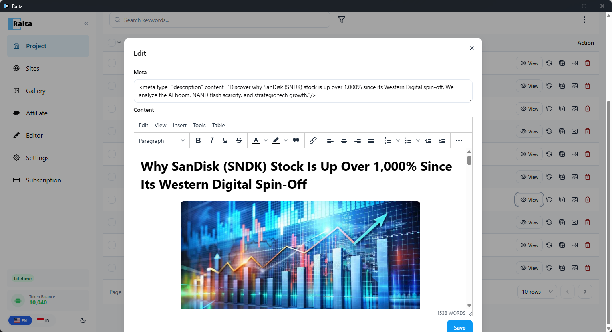
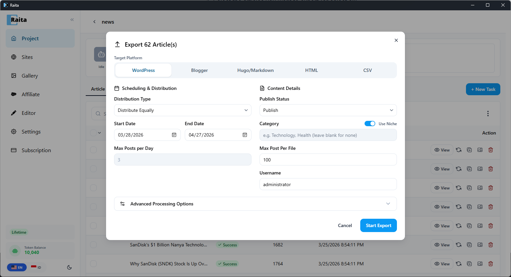

Panduan ini membawa Anda dari instalasi baru hingga artikel pertama dalam waktu kurang dari 10 menit.

Belum punya Raita? [Unduh dari halaman member](https://www.raita.ai/member).

---

## Langkah 1: Login

Buka Raita. Di layar login, masukkan email dan password Anda, lalu klik **Sign In**.

Jika belum punya akun, klik **Create account** dan selesaikan registrasi. Anda akan menerima email konfirmasi — klik link untuk mengaktifkan akun.

---

## Langkah 2: Buat Project

Setelah login, Anda akan melihat halaman Projects. Klik **New Project**, masukkan nama project (misalnya "Project Pertama"), dan klik **Create**.

Project adalah wadah untuk semua artikel Anda. Anda bisa punya beberapa project untuk website atau niche yang berbeda.

---

## Langkah 3: Buat Article Worker Pertama

Klik **+ New Task**.

Isi:
- **Topic** — topik artikel (misalnya "sepatu hiking terbaik untuk pemula")
- **Niche** — area topik situs Anda (misalnya "perlengkapan outdoor")
- **Language** — bahasa target (misalnya "Indonesian")

Pilih **starter template** (Simple V4 direkomendasikan) atau masukkan prompt kustom di tab **Simple**. Starter template sudah dikonfigurasi — cukup masukkan keyword dan mulai.

Klik **Submit** untuk memulai generasi.

---

## Langkah 4: Tunggu Generasi

Worker Anda akan muncul di tabel artikel dengan status **Pending**, lalu **Running**. Generasi biasanya memakan waktu 30–90 detik.

Setelah selesai, status berubah menjadi **Success**.

---

## Langkah 5: Review Hasil

Klik tombol **View** untuk membuka editor artikel. Anda akan melihat artikel yang dihasilkan dengan toolbar rich text — sesuaikan heading, format, dan konten sesuai kebutuhan. Klik **Save** setelah selesai.

---

## Langkah 6: Export

Gunakan menu ⋮ dan klik **Bulk Export**, atau klik tombol export pada baris individual. Pilih format:

- **WordPress** — import langsung ke WordPress via Tools → Import
- **Blogger** — format Atom Blogger
- **Hugo/Markdown** — file markdown
- **HTML** — file HTML standalone
- **CSV** — format spreadsheet

Konfigurasi opsi penjadwalan dan distribusi, lalu klik **Start Export**.

---

## Langkah Selanjutnya

- Pelajari [Blaze mode](../core-workflows/blaze-mode.md) dan [Compose mode](../core-workflows/compose-mode.md) untuk artikel long-form yang lebih terstruktur
- Set up [Auto-Pilot](../automation/auto-pilot.md) untuk auto-generate artikel dari Google Trends atau RSS feed
- Hubungkan situs WordPress Anda untuk [direct publishing](../publishing/wordpress.md)
