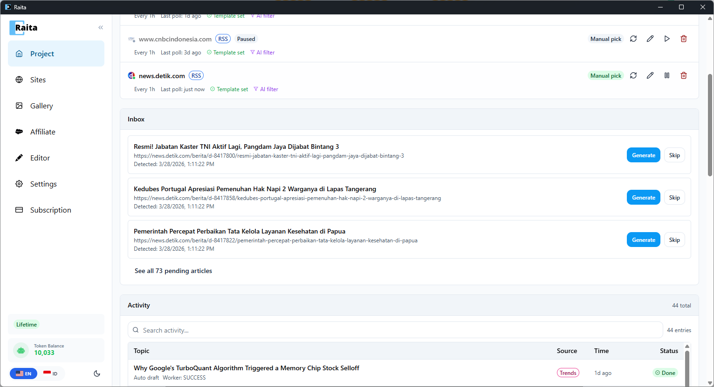
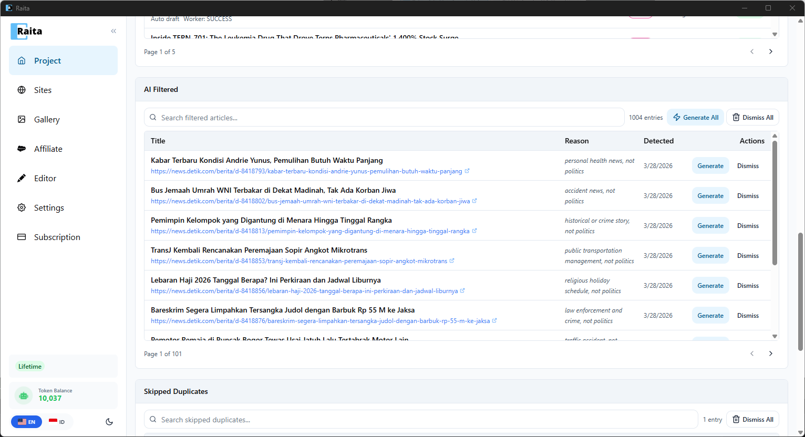

Panduan ini membawa Anda melalui penyiapan bot konten otomatis yang memantau feed berita RSS, menyaring artikel berdasarkan niche Anda, dan membuat artikel unik — semuanya secara otomatis.

Kami akan menggunakan **news.detik.com** sebagai sumber RSS contoh dan menyiapkan filter AI untuk hanya membuat artikel tentang politik.

---

## Langkah 1: Buat Proyek

Jika belum melakukannya, buat proyek untuk bot otomatis Anda. Buka **Project** di sidebar dan klik **New Project**. Beri nama seperti "Politics News Bot".

---

## Langkah 2: Buka Auto-Pilot

Di dalam proyek Anda, klik **+ New Task** untuk membuka pemilih task. Pilih **Auto-Pilot**.


---

## Langkah 3: Pilih Sumber RSS / Sitemap

Di bawah **Source Type**, pilih **RSS / Sitemap**.

Konfigurasikan feed:
- **Feed Type** — RSS / Atom
- **Feed URL** — `https://news.detik.com/berita/rss`
- Klik **Check** untuk memverifikasi feed valid

Atur interval **Check every** — seberapa sering Raita polling untuk artikel baru (contoh: setiap 1 jam).


---

## Langkah 4: Atur Perilaku

- **When new content is found** — pilih **Auto create article (draft)**. Ini memungkinkan Raita otomatis membuat artikel dari setiap item feed yang cocok tanpa persetujuan manual — Anda selalu dapat meninjau dan mengeditnya nanti di tab Article Worker.
- **Title & Keyword** — pilih cara mengekstrak judul artikel (contoh: "Rewrite title (slug as keyword)")

---

## Langkah 5: Atur Filter AI

Inilah keajaiban terjadi. Di bidang **AI Filter**, masukkan prompt yang menjelaskan artikel mana yang harus diterima:

```
only work on politics
```

AI mengevaluasi setiap entri RSS baru terhadap prompt ini. Artikel tentang politik akan lolos; yang lain (olahraga, hiburan, berita kesehatan, dll.) disaring dan dikirim ke bagian AI Filtered.


---

## Langkah 6: Atur Batas Harian

Pilih **Daily limit** untuk mengontrol berapa banyak artikel yang dibuat per hari (contoh: 50 artikel/hari). Ini mencegah pembuatan yang tidak terkontrol dari feed dengan volume tinggi.

---

## Langkah 7: Pilih Template Prompt

Di bawah **Generation Prompt**, pilih template starter:
- **Simple V4** *(Direkomendasikan)* — cepat, pembuatan sekali jalan dengan pencarian web
- **Blaze V4** — multi-tahap untuk artikel yang lebih panjang
- **Compose V4** — berbasis bagian untuk kontrol penuh

Konten artikel sumber dan URL otomatis diinjeksi ke dalam prompt, jadi artikel yang dibuat akan berdasarkan cerita berita asli.

---

## Langkah 8: Mulai Bot

Klik **Generate** untuk mengaktifkan bot otomatis Anda. Raita akan segera polling feed dan mulai memproses artikel.

---

## Memantau Bot Anda

Feed Anda muncul di bagian **Active Feeds** dari tab Auto-Pilot. Di bawahnya Anda akan melihat:

### Inbox
Artikel yang lolos filter AI masuk ke sini (jika menggunakan Manual pick). Klik **Generate** untuk membuat artikel, atau **Skip** untuk menolaknya.



### Activity Log
Semua artikel yang dibuat muncul di sini dengan sumber, waktu, dan status mereka. Mereka juga muncul di tab **Article Worker** biasa.

### AI Filtered
Artikel yang ditolak oleh filter Anda muncul di sini dengan alasannya (contoh: "personal health news, not politics"). Anda masih dapat klik **Generate** untuk mengatasi filter, atau **Dismiss** untuk menghapusnya.



---

## Langkah Berikutnya

- Tambahkan lebih banyak feed RSS dari sumber berita yang berbeda untuk memperkaya konten Anda
- Atur [Google Trends](../automation/google-trends.md) sebagai sumber tambahan untuk penemuan topik trending
- Hubungkan [situs WordPress](../publishing/wordpress.md) Anda dan beralih ke **Auto publish** untuk sepenuhnya mengotomatisasi pipeline
- Jelajahi [Clone Bot](../automation/clone-bot.md) untuk mengkloning daftar artikel pesaing
