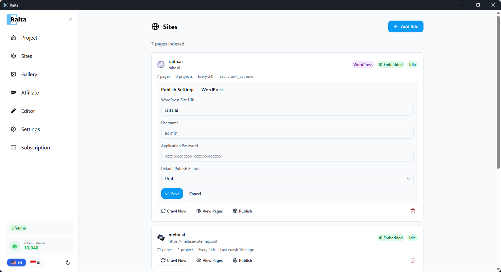
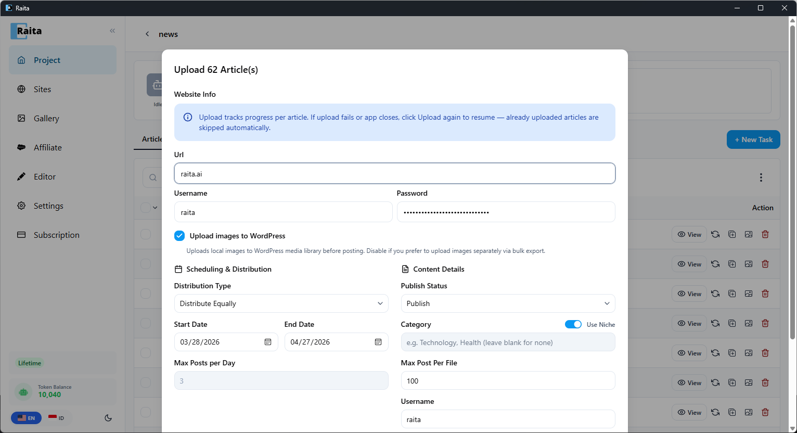

Raita mendukung dua metode untuk mendapatkan artikel ke WordPress:

| Metode | Cara | Terbaik untuk |
|---|---|---|
| **XML Export** | Unduh file WordPress WXR, impor melalui admin WordPress | Impor sekali atau batch tanpa penyiapan API |
| **Direct Upload** | Publikasikan melalui WordPress REST API dari Raita | Penerbitan otomatis yang sedang berlangsung |

---

## Metode 1: XML Export

1. Pilih artikel yang ingin Anda ekspor (atau pilih semua)
2. Klik **Export**
3. Pilih **WordPress XML**
4. Unduh file `.xml`

Untuk mengimpor ke WordPress:
1. Di admin WordPress Anda, buka **Tools → Import**
2. Pilih importer **WordPress**
3. Unggah file `.xml`
4. Peta author dan klik **Submit**

---

## Metode 2: Direct Upload (WordPress REST API)

### Langkah 1: Konfigurasikan Pengaturan Penerbitan

Buka **Sites** di sidebar. Klik situs WordPress Anda (atau tambahkan satu) dan konfigurasikan bagian **Publish Settings — WordPress**:

- **WordPress Site URL** — domain situs Anda (contoh: `raita.ai`)
- **Username** — nama pengguna admin WordPress Anda
- **Application Password** — buat satu di WordPress di bawah **Users → Profile → Application Passwords**
- **Default Publish Status** — Draft atau Publish

Klik **Save**.

### Langkah 2: Unggah Artikel

1. Buka proyek Anda dan gunakan **Bulk Upload** dari menu ⋮, atau klik tombol unggah di artikel individual
2. Masukkan **URL** situs Anda, **Username**, dan **Password** (sudah diisi jika dikonfigurasi di Sites)
3. Secara opsional aktifkan **Upload images to WordPress** untuk mengirim gambar ke perpustakaan media Anda
4. Konfigurasikan **Scheduling & Distribution**:
   - **Distribution Type** — distribusikan secara merata atau sekaligus
   - **Start/End Date** — jadwalkan posts di seluruh rentang tanggal
   - **Max Posts per Day** — batasi tingkat penerbitan harian
5. Konfigurasikan **Content Details**:
   - **Publish Status** — Draft atau Publish
   - **Category** — tetapkan kategori (alihkan "Use Niche" untuk isi otomatis)
6. Klik **Start Export**

---

## Tips

- Upload langsung memerlukan WordPress REST API diaktifkan (aktif secara default di WordPress 5.6+)
- Gunakan status **Draft** untuk tinjauan sebelum publikasikan secara langsung
- Jika upload gagal dengan kesalahan 401, periksa kembali password aplikasi Anda
