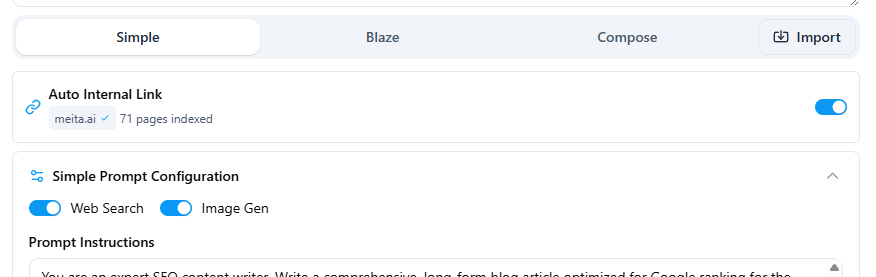

Raita dapat secara otomatis membuat dan menyuntikkan internal links ke artikel Anda, menggunakan indeks situs yang dikrawl.

---

## Prasyarat

Anda harus memiliki setidaknya satu situs yang dikrawl di [Site Connector](site-connector-setup.md).

---

## Auto Internal Link (Blaze & Compose)

Aktifkan **Auto Internal Link** dalam formulir worker untuk membuat Raita secara otomatis memilih dan menyuntikkan internal links yang relevan ke artikel yang dibuat.



Saat diaktifkan, Raita:
1. Melihat topik artikel dan konten yang dibuat
2. Menemukan halaman yang paling mirip secara semantik dalam indeks situs Anda
3. Menyisipkan link ke halaman-halaman tersebut di titik-titik yang sesuai dalam artikel

---

## Manual Internal Link Target

Alih-alih (atau sebagai tambahan) auto internal links, Anda dapat menentukan **Internal Link Target** eksplisit — URL ke sitemap Anda atau daftar halaman spesifik.

Macro `{sitemap=URL}` kemudian dapat digunakan dalam prompt Anda untuk membiarkan AI memilih halaman linked yang paling relevan.

---

## Variabel Internal Link

Gunakan variabel ini dalam prompt detail Blaze Anda atau prompt bagian Compose untuk menyuntikkan link di titik-titik spesifik:

| Variabel | Mode | Menyisipkan |
|---|---|---|
| `{internal_links}` / `{internalLinks}` | Blaze | Tag anchor HTML untuk semua internal links yang dibuat |
| `{internalLink}` | Compose | Satu tag anchor internal link |
| `{random5InternalLink}` | Compose | 5 tag anchor internal link yang dipilih secara acak |

Contoh prompt detail Blaze dengan internal links:

```
Write the section "{section}" for an article about {topic}.

Where relevant, naturally include some of these internal links:
{internalLinks}

HTML format, 300-500 words.
```

---

## Pemecahan Masalah

- Jika `{internalLinks}` muncul dalam output artikel akhir (tidak diganti), berarti tidak ada internal links yang dibuat. Periksa bahwa situs Anda dikrawl dan Internal Link Target dikonfigurasi.
- Jika status crawl situs menunjukkan **Failed**, buka [Setting Up Site Connector](site-connector-setup.md) dan klik **Re-crawl** setelah menyelesaikan kesalahan jaringan atau URL apa pun.
- Internal links disuntikkan ke jumlah bagian terbatas — tidak setiap bagian akan menerima links.
