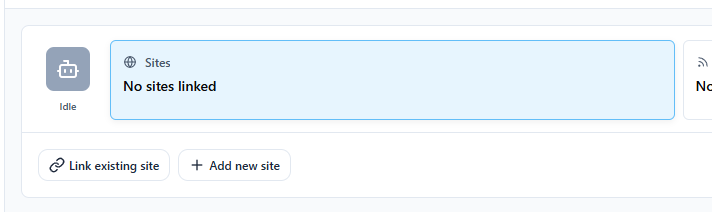
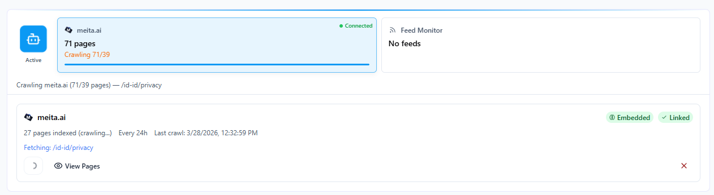

Site Connector membuat crawl situs web Anda dan mengindeksnya sehingga Raita dapat membuat internal link yang sadar konten dan memahami konten yang ada.

---

## Penyiapan

1. Buka **Sites** di sidebar
2. Klik **Add Site**
3. Masukkan URL dasar situs Anda (contoh: `https://mysite.com`)
4. Klik **Save**

---

## Crawling

Setelah menambahkan situs, klik **Start Crawl** untuk memulai pengindeksan.

Raita akan:
1. Ambil sitemap Anda (jika tersedia) atau crawl link dari homepage
2. Kunjungi setiap halaman dan ekstrak konten teks
3. Hasilkan vector embeddings untuk setiap halaman
4. Simpan embeddings secara lokal untuk similarity search

---

## Status Crawl

| Status | Arti |
|---|---|
| **Idle** | Belum dikrawl |
| **Crawling** | Sedang berlangsung |
| **Done** | Crawl selesai, halaman diindeks |
| **Failed** | Crawl mengalami error |

Klik **View Pages** untuk melihat daftar URL yang diindeks dan preview kontennya.

---

## Re-Crawling

Jika konten situs Anda berubah, klik **Re-crawl** untuk memperbarui indeks. Indeks yang ada diganti.

---

## Use Cases

Setelah situs dikrawl:
- Raita dapat membuat internal link yang relevan secara kontekstual untuk artikel baru
- Macro `{sitemap=}` dapat mereferensikan sitemap situs Anda
- Bidang link internal dalam mode Blaze dan Compose menggunakan indeks yang dikrawl

Lihat [Using Internal Links](internal-links.md) untuk cara mengonfigurasi ini di worker Anda.
