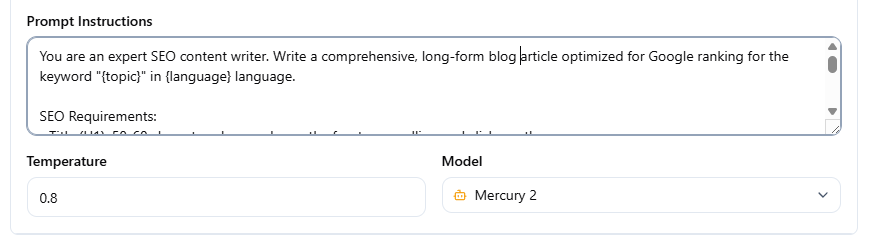

Variables are placeholders in your prompt text that Raita replaces at generation time.

Write them as `{variableName}` anywhere in a prompt field.

---

## Common Variables (all modes)

| Variable | Replaced with |
|---|---|
| `{topic}` | The Article Worker's topic field |
| `{keyword}` | Same as `{topic}` (alias) |
| `{niche}` | The worker's niche field |
| `{language}` | The worker's language field |
| `{topicQueryParam}` | URL-encoded version of `{topic}` (used in search macros) |

---

## Blaze Mode Variables

These are only available in Blaze mode prompts, and only at the stage where they are generated:

| Variable | Available in | Replaced with |
|---|---|---|
| `{title}` | Detail, Meta, Opening, Closing | Generated title |
| `{lsi}` | Detail | Generated section list (newline-separated) |
| `{outline}` | Detail | Same as `{lsi}` — full outline text |
| `{section}` | Detail | Current section heading being generated |
| `{subtopic}` | Detail | Current subtopic |
| `{index}` | Detail | Section index number (0-based) |
| `{item}` | Detail | Current item from outline |
| `{internal_links}` / `{internalLinks}` | Detail | Generated internal link HTML |

---

## Compose Mode Variables

| Variable | Replaced with |
|---|---|
| `{title}` | Generated title (if title prompt set) |
| `{index}` | Section index number (0-based) |
| `{internalLink}` | One internal link from the target list |
| `{random5InternalLink}` | 5 randomly selected internal links |
| `{chain}` | All previously generated sections (sequential mode only) |

---

## Special Flags

| Flag | Effect |
|---|---|
| `{debug}` | (Simple mode only) Return the injected prompt text without calling the AI |
| `{webSearch}` | Enable web search for this prompt (provider-dependent — see [AI Provider Setup](../getting-started/ai-provider-setup.md)) |
| `{imagegen}` | Trigger image generation for this article |

---

## Tips

- Variables are case-sensitive: `{topic}` works, `{Topic}` does not
- Variables that can't be resolved are left as-is in the prompt (e.g. if `{title}` is used before title generation runs)
- `{internalLinks}` that reach the scraper layer unresolved are stripped automatically
