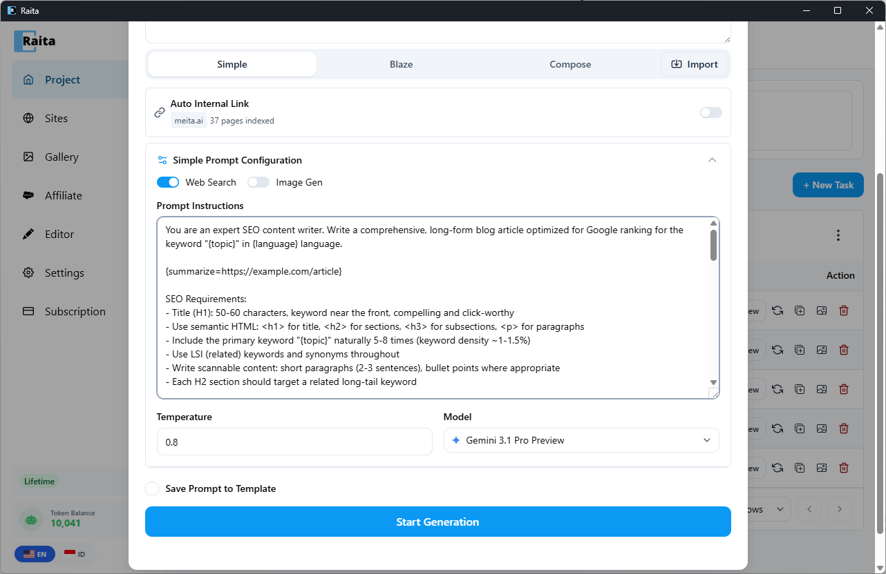

Scraper macros fetch and summarize external content at generation time. They are expanded **after** variable injection, so you can use variables inside macro arguments.



---

## Short Aliases

These are convenience shortcuts that auto-expand to longer explicit macros:

| Alias | Expands to |
|---|---|
| `{bingSearch}` | Bing search for `{topicQueryParam}`, summarized |
| `{googleSearch}` | Google search for `{topicQueryParam}`, summarized |
| `{duckduckgoSearch}` | DuckDuckGo search for `{topicQueryParam}`, summarized |
| `{yahooSearch}` | Yahoo search for `{topicQueryParam}`, summarized |
| `{topThreeBingSummarized}` | Top 3 Bing results for `{topicQueryParam}`, each summarized |
| `{topThreeGoogleSummarized}` | Top 3 Google results for `{topicQueryParam}`, each summarized |

Usage example:
```
Research: {bingSearch}

Using the research above, write an article about {topic}.
```

---

## Explicit Macros

For more control, use explicit macro syntax with a URL argument:

### `{scrap=URL}`

Fetches the URL and uses AI to extract the most relevant content from the page.

```
Reference material: {scrap=https://example.com/source-article}

Write a unique article about {topic} inspired by the above.
```

### `{summarize=URL}`

Fetches the URL and returns a structured summary (title, key points, main arguments).

```
Summary of competitor content: {summarize=https://competitor.com/article}
```

### `{summarizeNonStructured=URL}`

Fetches the URL and returns a journalistic-style report (flowing prose, not bullet points).

### `{sitemap=URL}`

Fetches a sitemap XML and asks the AI to pick the most relevant page for the current `{topic}`.

### `{sitemapSummarize=URL}`

Fetches a sitemap, picks the most relevant page, then summarizes that page. Combines `{sitemap=}` and `{summarize=}`.

```
Context from my site: {sitemapSummarize=https://mysite.com/sitemap.xml}
```

### `{topThreeBingSummarized=QUERY}`

Searches Bing for QUERY, fetches the top 3 results, and returns a summary of each.

```
Research: {topThreeBingSummarized={topicQueryParam}}
```

### `{topThreeGoogleSummarized=QUERY}`

Same as above but uses Google.

---

## `{webSearch}` — Provider-Level Web Search

`{webSearch}` is **not** a scraper macro. It is a flag that enables native web search at the AI provider level:

- **OpenAI** — switches to the `/v1/responses` API and attaches the `web_search` tool. The AI searches the web as part of its response generation.
- **Gemini** — enables Google Grounding.
- **OpenRouter / Custom** — the flag is stripped; no web search occurs.

`{webSearch}` can be added via the **Web Search toggle** in the prompt editor, or typed directly into the prompt.

---

## Performance Note

Scraper macros make HTTP requests and AI calls during prompt expansion. Prompts with multiple macros will take longer to generate. For `topThree*` macros, expect 3 additional AI calls per macro.
