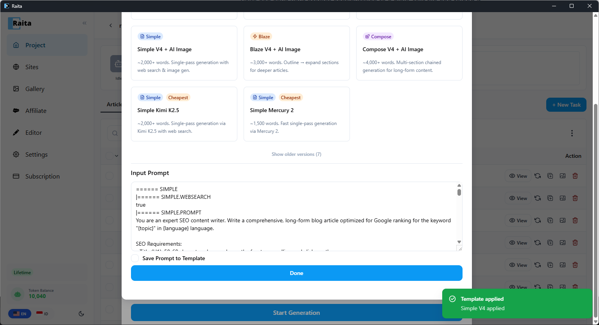

Raita can save your prompt configuration to a plain-text file and reload it later. Use this to:
- Share prompt templates with teammates
- Version-control your prompts in git
- Reuse a proven prompt setup across multiple projects



---

## Exporting a Template

1. Configure your prompts in the New Task form (Simple, Blaze, or Compose tab)
2. Click **Export Template**
3. Save the `.txt` file

---

## Template File Format

Templates are plain text files with section markers. Here is a Simple mode example:

````
====== SIMPLE

|====== SIMPLE.PROMPT
Write a comprehensive article about {topic} for a {niche} audience.
Use HTML formatting. Language: {language}.

|====== SIMPLE.TEMPERATURE
0.7

|====== SIMPLE.MODEL
gpt-4o

|====== SIMPLE.WEBSEARCH
false

|====== SIMPLE.IMAGEGEN
false

|====== AUTO_INTERNAL_LINK
false
````

A Blaze mode template uses `====== BLAZE` at the top, with markers like `|====== TITLE.PROMPT`, `|====== SECTION.PROMPT`, `|====== DETAIL.PROMPT`, etc.

A Compose mode template uses `====== COMPOSE` with `|====== META.PROMPT`, `|====== CONTENT_1.PROMPT`, `|====== CONTENT_2.PROMPT`, etc.

---

## Editing a Template

Open the exported file in any text editor. Edit the prompt text between the markers. Save the file.

Rules:
- Do not change the marker lines (lines starting with `|======` or `======`)
- Temperature must be a decimal number (e.g. `0.7`)
- Model must be a valid model ID string
- WEBSEARCH and IMAGEGEN must be `true` or `false`

---

## Importing a Template

1. Open the New Task form
2. Click **Import Template**
3. Select your `.txt` file
4. The form fields will populate with the template's values
5. Adjust any fields as needed, then submit
