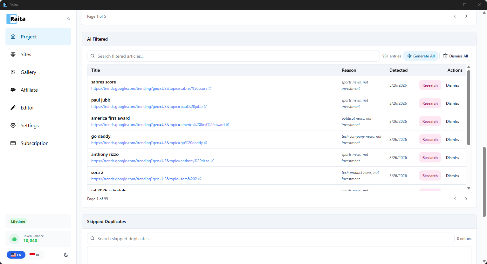

Auto-Pilot automatically discovers trending topics and generates articles on a schedule. It supports two source types: **RSS / Sitemap** feeds and **Google Trends**.

---

## Setup

Auto-Pilot is configured per project. Go to your project and click the **Auto-Pilot** tab.

### 1. Choose a Source Type

- **RSS / Sitemap** — monitor news feeds and sitemaps, then generate articles from newly published URLs
- **Google Trends** — watch daily trending searches and draft articles around rising topics

### 2. Configure the Source

For **Google Trends**:

- **Trend Region** — choose the country to monitor (e.g. United States, Indonesia)
- **Check every** — how often to check for new trends (e.g. every 1 hour)
- **Articles per trend** — how many unique article ideas to generate per trending topic (default: 2)

For **RSS / Sitemap**:

- **Feed URL** — the RSS/Atom feed or sitemap URL to monitor
- **Check every** — polling interval

### 3. Set Behavior

- **When new content is found** — choose to auto-create articles as drafts or auto-publish
- **Title & Keyword** — how to extract article titles (e.g. rewrite trend into original headline)
- **Daily limit** — maximum articles generated per day

### 4. Set AI Filter (Optional)

Add a filter prompt to only generate articles that match your niche:

> e.g. "Only generate articles about coffee. Skip news roundups and opinion pieces."

AI evaluates each new entry against this prompt to decide whether to generate. Leave empty to accept all.

### 5. Choose a Prompt Template

Select a generation prompt — pick a starter template (Simple V4, Blaze V4, Compose V4) or configure manually.

### 6. Start

Click **Generate** to activate Auto-Pilot. It will begin monitoring and generating articles automatically.

---

## Active Feeds & Inbox

Once configured, your feeds appear in the **Active Feeds** section of the Auto-Pilot tab. Each feed shows its type (RSS, Google Trends), polling interval, last poll time, and current status.

Below the active feeds is the **Inbox** — this is where new items land when the source policy is set to manual review, or when AI is unsure about a trend's relevance.

### Working with the Inbox

Each inbox item shows the trend or article title, detection date, and two actions:

- **Research** — AI researches the trend and generates multiple unique article ideas based on it. These are then queued as Article Workers.
- **Skip** — dismiss the trend if it doesn't match your niche

For auto-draft or auto-publish sources, articles are created automatically without appearing in the inbox.

---

## Activity Log

Created articles show up in both the regular **Article Worker** table and the **Activity** log on the Auto-Pilot tab. The activity log shows each generated article with its topic, source (Trends/RSS), time, and status.

---

## AI Filtered

Below the activity log is the **AI Filtered** section. This shows trends and articles that were rejected by your AI filter, along with the **Reason** why they were filtered (e.g. "sports news, not investment").

Each filtered item has two actions:
- **Research** — override the filter and generate articles from this trend anyway
- **Dismiss** — permanently remove it from the list

You can also **Generate All** or **Dismiss All** in bulk.

Below AI Filtered is the **Skipped Duplicates** section, showing items that were skipped because they were already generated.

