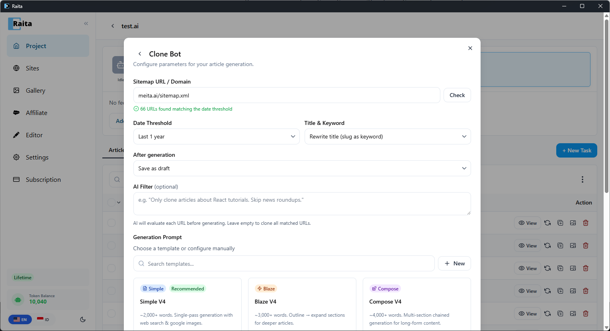

Clone Bot lets you clone an entire website's content by reading its sitemap and generating new articles based on those URLs — using a prompt template of your choice.

**Use case:** You want to clone your other site's article list to a new domain, or replicate a competitor's topic coverage with your own unique articles.

---

## How to Use Clone Bot

1. Enter a **Sitemap URL or Domain** (e.g. `meita.ai/sitemap.xml`) and click **Check** — Raita fetches and parses all article URLs
2. Set **Date Threshold** to filter by recency (e.g. "Last 1 year") and choose how to extract **Title & Keyword** from the URLs
3. Choose what happens **After generation** — save as draft or publish directly
4. Optionally set an **AI Filter** to skip irrelevant URLs (e.g. "Only clone articles about React tutorials. Skip news roundups.")
5. Choose a **Generation Prompt** — pick a starter template (Simple V4, Blaze V4, Compose V4) or configure manually
6. Click **Clone Article**

---

## Reviewing URLs

After clicking **Clone Article**, Raita shows a list of all matched URLs. Review the list and remove any URLs you don't want to clone (e.g. landing pages, pricing pages, non-article content) by clicking the delete icon next to each URL.

When ready, click **Clone Articles** to start generation.

---

## Configuration Options

| Option | Description |
|---|---|
| **Sitemap URL / Domain** | The source sitemap or domain to scan for articles |
| **Date Threshold** | Only include articles published within this period |
| **Title & Keyword** | How to extract the article title — rewrite from slug, use page title, etc. |
| **After generation** | Save as draft or auto-publish to connected WordPress site |
| **AI Filter** | Optional prompt to evaluate each URL — AI decides which to include |
| **Generation Prompt** | The prompt template to use for generating the cloned articles |

---

## Notes

- Workers created by Clone Bot are identical to manually created workers — they appear in the same table and can be retried, edited, or exported
- If no template is attached, workers use the project's default Simple mode prompt
- Large URL lists (100+) may take time to queue — the queue processes workers according to the batch-per-run setting in Settings
- Batch progress is tracked and displayed until all workers are created
