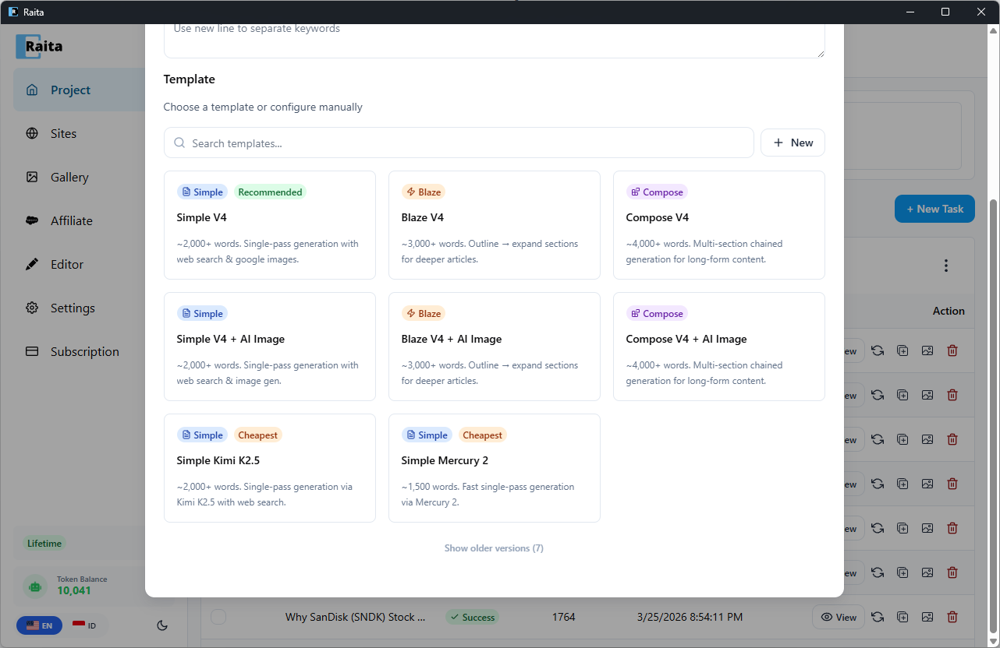
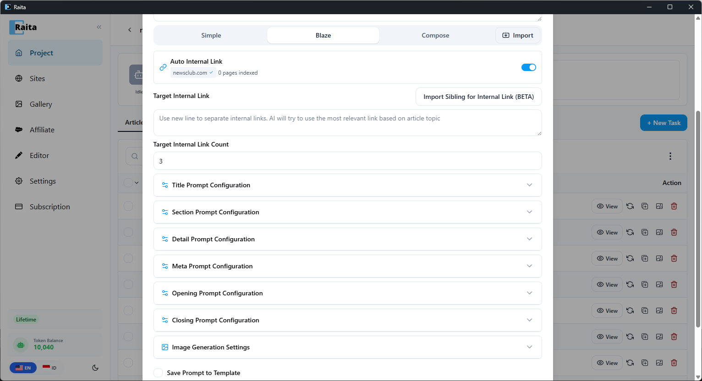

Blaze mode assembles an article through **multiple sequential AI calls**: generate title → generate outline → generate section bodies → optionally add meta/opening/closing → inject internal links → concatenate.

**Best for:**
- Long-form, structured articles (2,000+ words)
- When you want granular control over each stage of generation
- Building content with consistent heading structure

---

## Starter Templates

Raita ships with ready-to-use Blaze templates so you can start generating immediately:



| Template | Description |
|---|---|
| **Blaze V4** | ~3,000+ words. Outline → expand sections for deeper articles. |
| **Blaze V4 + AI Image** | ~3,000+ words. Outline → expand sections with AI image generation. |

To use a starter template, click **+ New Task**, then select a template from the template picker. All prompt stages (title, outline, detail, etc.) are pre-configured — just enter your keywords and generate.

---

## Configuration

In the New Task form, select the **Blaze** tab.



---

## Required Fields

### Title Prompt

Generates the article title. Receives `{topic}`, `{niche}`, `{language}`.

Example:
```
Write one compelling, SEO-friendly article title for a post about {topic}.
Target audience: {niche}. Language: {language}.
Return only the title, no quotes or explanation.
```

### LSI / Section Prompt

Generates the outline — a list of section headings. The output of this prompt becomes `{lsi}` and `{outline}` for later stages.

Example:
```
Generate a list of 5-7 section headings for an article titled "{title}" about {topic}.
Return one heading per line. No numbering, no explanation.
```

### Detail Prompt

Generates the body of each section. Called once per section. Receives `{title}`, `{section}`, `{lsi}`, `{outline}`, `{topic}`, `{index}`.

Example:
```
Write the full content for the section "{section}" in an article about {topic}.
Article title: {title}
Full outline: {outline}
Write in HTML with h3 subheadings and paragraphs. 300-500 words.
```

---

## Optional Fields

### Meta Prompt

Generates an HTML `<meta>` description. Receives `{title}`, `{topic}`.

### Opening Prompt

Generates an introductory paragraph inserted before the first section.

### Closing Prompt

Generates a conclusion paragraph appended after the last section.

### Internal Link Prompt

Generates internal links to insert into the article. Works together with **Internal Link Target** (the URL of your site's sitemap or page list).

See [Using Internal Links](../site-intelligence/internal-links.md) for setup details.

---

## Execution Order

Blaze runs stages in this order:
1. Generate title
2. Generate outline (LSI section list)
3. Generate internal links (if configured)
4. Generate meta / opening / closing (in parallel)
5. Generate each section body (using `{section}` from the outline)
6. Inject internal links into selected sections
7. Concatenate: opening + sections + closing (meta description is stored as a separate field, not part of the body)

The final article is assembled from all these pieces.

---

## Available Variables by Stage

| Stage | Variables available |
|---|---|
| Title | `{topic}`, `{keyword}`, `{niche}`, `{language}` |
| LSI/Outline | `{title}`, `{topic}`, `{keyword}`, `{niche}`, `{language}` |
| Detail | `{title}`, `{section}`, `{lsi}`, `{outline}`, `{topic}`, `{keyword}`, `{niche}`, `{language}`, `{index}`, `{subtopic}`, `{item}` |
| Meta/Opening/Closing | `{title}`, `{topic}`, `{keyword}`, `{niche}`, `{language}` |
| Internal Links | `{topic}`, `{keyword}`, `{title}`, `{niche}`, `{language}`, `{internal_links}` |

See [Prompt Variables Reference](../reference/prompt-variables.md) for the full list.
