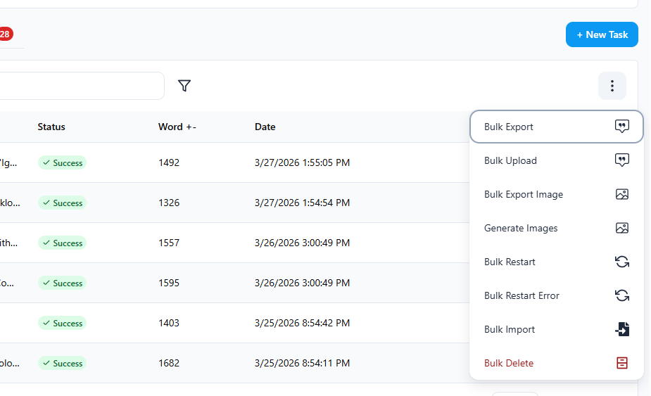
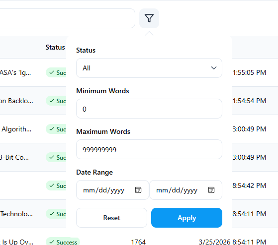

## Viewing & Editing a Result

Click the **View** button on any row in the article table to open the article. This opens a rendered HTML editor where you can read and edit the generated content directly.

The editor supports rich text — use the toolbar to adjust headings, formatting, lists, and links. You can also edit the **Meta** description. Click **Save** to persist your changes.

---

## Row Actions

Each worker row has inline action buttons on the right side:

| Button | Action |
|---|---|
| **View** | Open the article in the editor |
| **Retry** | Re-run the worker to regenerate the article |
| **Copy** | Copy the article HTML to your clipboard |
| **Export** | Export the individual article |
| **Delete** | Permanently delete the worker and its result |

---

## Bulk Actions

Click the **⋮** menu button (top-right of the article table) to access bulk actions:

- **Bulk Export** — export all articles (WordPress XML, HTML, CSV, etc.)
- **Bulk Upload** — upload all articles to your connected WordPress site
- **Bulk Export Image** — export all generated images
- **Generate Images** — generate images for articles that don't have one
- **Bulk Restart** — re-run all workers
- **Bulk Restart Error** — re-run only failed workers
- **Bulk Import** — import topics from a CSV/XLSX file
- **Bulk Delete** — delete all workers

---

## Filtering & Search

Use the **search bar** to search articles by keyword. Click the **filter icon** next to the search bar to open the filter panel:

- **Status** — filter by status (All, Success, Failed, Running, Pending)
- **Minimum / Maximum Words** — filter by word count range
- **Date Range** — filter by generation date

Click **Apply** to apply filters, or **Reset** to clear them.
