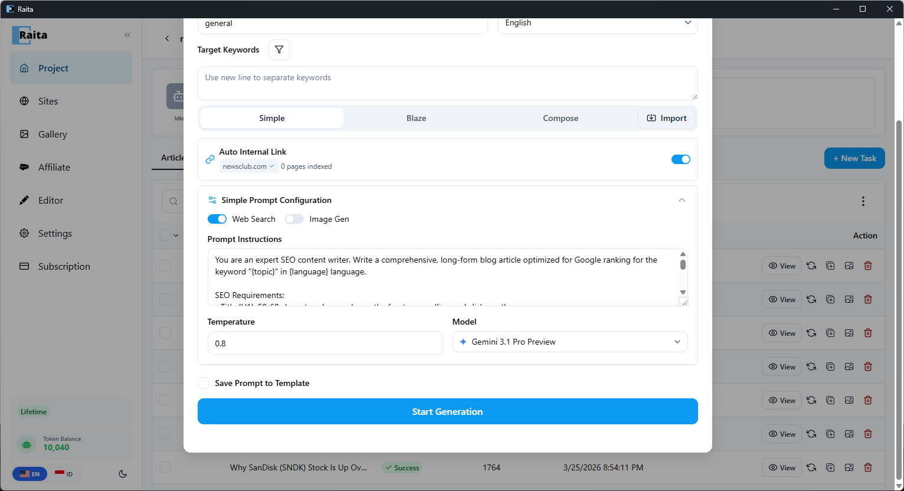

Simple mode sends **one prompt** to the AI and returns the result as your article. It's the fastest and most flexible mode.

**Best for:**
- Short to medium-length articles
- When you want full control over the output structure in a single prompt
- Quick one-shot generation

---

## Starter Templates

Raita ships with ready-to-use Simple templates so you can start generating immediately:


| Template | Description |
|---|---|
| **Simple V4** *(Recommended)* | ~2,000+ words. Single-pass generation with web search & Google images. |
| **Simple V4 + AI Image** | ~2,000+ words. Single-pass generation with web search & AI image generation. |
| **Simple Kimi K2.5** *(Cheapest)* | ~2,000+ words. Single-pass generation via Kimi K2.5 with web search. |
| **Simple Mercury 2** *(Cheapest)* | ~1,500 words. Fast single-pass generation via Mercury 2. |

To use a starter template, click **+ New Task**, then select a template from the template picker. The prompt, model, and settings are pre-configured — just enter your keywords and generate.

---

## Configuration

In the New Task form, select the **Simple** tab.



### Prompt

The main prompt sent to the AI. Supports all [prompt variables](../advanced-prompting/prompt-variables.md) and [scraper macros](../advanced-prompting/scraper-macros.md).

A good starting template:

```
Write a comprehensive, SEO-optimized article about {topic}.
The target audience is interested in {niche}.
Write in {language}.
Use HTML formatting with proper headings (h2, h3), paragraphs, and lists.
Include a compelling introduction and a conclusion.
```

### Temperature

Controls how creative/random the AI's output is. Range: 0.0–2.0.

| Value | Effect |
|---|---|
| 0.3–0.5 | More focused, consistent, factual |
| 0.7 | Balanced (default) |
| 1.0–1.5 | More creative, varied, sometimes surprising |

### Model

Override the default model for this specific prompt. If left blank, uses the model configured in Settings.

### Web Search

Toggle **Web Search** to enable the AI to search the web before generating. Behavior depends on your AI provider:
- **OpenAI** — uses OpenAI's built-in web search tool
- **Gemini** — uses Google Grounding
- **Other providers** — the `{webSearch}` flag is stripped; no web search occurs

### Image Gen

Toggle **Image Gen** to generate and attach an image to the article.

---

## Debug Mode

Add `{debug}` to the start of your prompt to preview the fully injected prompt without sending it to the AI. The result view will show the expanded prompt text instead of a generated article. Useful for checking that variables and macros resolved correctly.

---

## Multi-Prompt Randomization

Use `|` in your prompt to define alternatives. Raita picks one branch randomly at submission time:

```
Write a formal article about {topic} | Write a conversational article about {topic}
```

See [Randomization](../advanced-prompting/randomization.md) for details.
