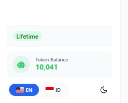

## Register

On the login screen, click **Create account**. Enter your email address and choose a password, then click **Sign Up**.

Check your inbox for a confirmation email and click the verification link. You must verify your email before logging in.

---

## Log In

Enter your email and password on the login screen, then click **Sign In**.

If you forgot your password, click **Forgot password** to receive a reset link by email.

---

## Subscription & License

Raita requires an active subscription or token balance to generate articles.

To purchase or manage your subscription:
1. Go to the [Raita member area](https://www.raita.ai/member) and log in
2. Choose a plan and complete checkout
3. Once purchased, your subscription will be automatically activated in the app

To check your plan status in the app:
1. Go to **Settings** → **License**
2. Your current plan and expiry date are shown here

---

## Token Wallet

If you're using Raita's managed AI (instead of your own API keys), article generation is billed in **Raita tokens**.

Your token balance is shown in the sidebar. To top up:
1. Click the token balance badge in the sidebar
2. Choose a token package and complete payment

See [Token Wallet & Billing Reference](../reference/token-wallet-billing.md) for pricing details.
