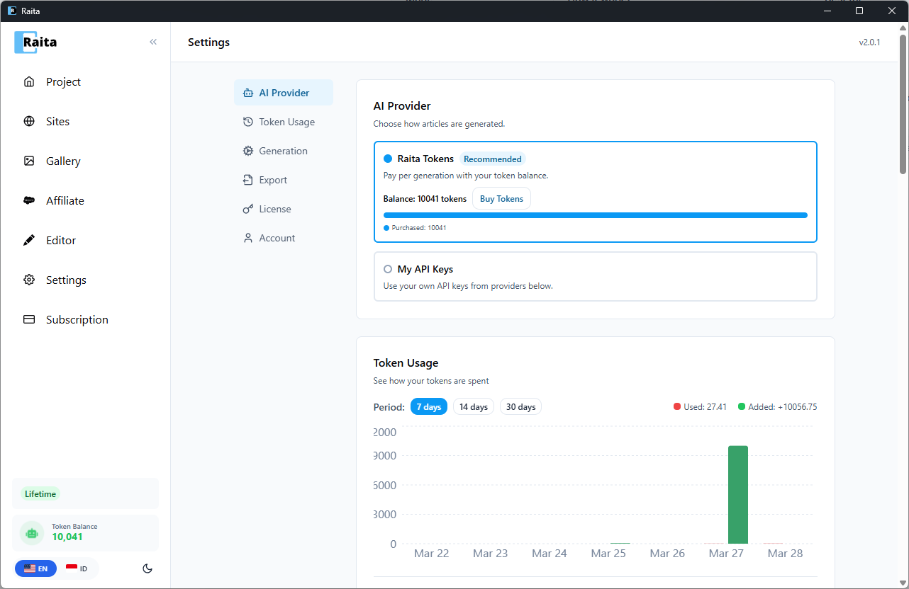

Raita supports two ways to run article generation:

| Mode | How it works | Best for |
|---|---|---|
| **Raita Managed** | Uses Raita's cloud pipeline, billed in Raita tokens | Getting started quickly, no API accounts needed |
| **BYOK (Bring Your Own Key)** | Calls AI providers directly using your API keys | Full control, use your own API quotas |

---

## Setting Up Raita Managed

1. Go to **Settings** → **AI Provider**
2. Select **Raita** as the AI source
3. Make sure you have tokens in your wallet (see [Account Setup](account-setup.md))
4. Click **Save**

---

## Setting Up BYOK

### OpenAI

1. Get an API key from [platform.openai.com](https://platform.openai.com)
2. In Raita Settings → **AI Provider**, select **OpenAI**
3. Paste your key into the **OpenAI API Key** field
4. Click **Save**

Available models include GPT-4o, GPT-4o-mini, GPT-4.1, GPT-4.1 Mini. Web search is supported via OpenAI's web search tool.

### Google Gemini

1. Get an API key from [aistudio.google.com](https://aistudio.google.com)
2. Select **Gemini** in AI Provider settings
3. Paste your key into the **Gemini API Key** field
4. Click **Save**

Available models include Gemini 1.5 Pro, Gemini 1.5 Flash, Gemini 2.0 Flash. Grounding (web search) is supported.

### Azure OpenAI

1. Create an Azure OpenAI resource in the Azure portal
2. Deploy a model (e.g. `gpt-4o`)
3. In Raita Settings, select **Azure**
4. Enter your Azure **Endpoint URL**, **API Key**, and **Deployment Name**
5. Click **Save**

### OpenRouter

1. Get an API key from [openrouter.ai](https://openrouter.ai)
2. Select **OpenRouter** in AI Provider settings
3. Paste your key into the **OpenRouter API Key** field
4. Click **Save**

OpenRouter gives access to many models from different providers through a single key.

### Custom Endpoint

For any OpenAI-compatible API (local models via Ollama, LM Studio, etc.):
1. Select **Custom** in AI Provider settings
2. Enter the **Base URL** of your endpoint (e.g. `http://localhost:11434/v1`)
3. Enter an API key if your endpoint requires one
4. Click **Save**
