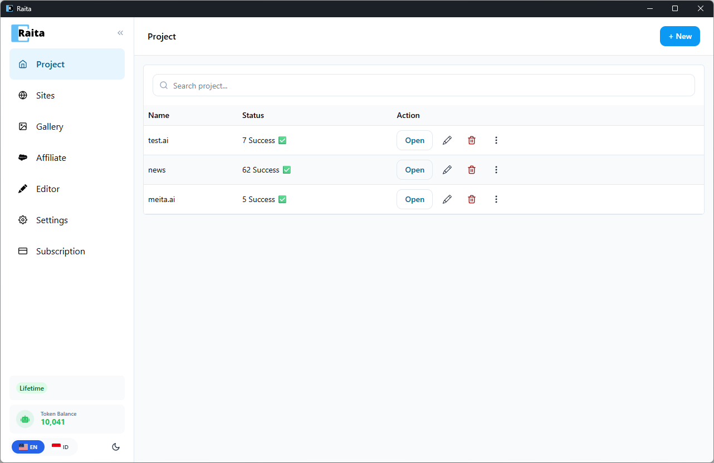

Raita is an AI-powered content operations desktop app for Windows and macOS.

It lets you generate, manage, and publish articles at scale using large language models — with your own API keys (BYOK) or Raita's managed token system.

---

## What You Can Do With Raita

**Generate articles** — create SEO-optimized articles using one of three generation modes:
- **Simple** — one-shot generation from a single prompt
- **Blaze** — multi-stage assembly (title → outline → sections → meta)
- **Compose** — section-by-section composition with full control over structure

**Automate content creation** using:
- **Feed Monitor** — watch RSS feeds and auto-generate articles from new items
- **SILO Planner** — plan and generate a full content silo from a single topic
- **Clone Bot** — batch-generate articles from a topic list using a shared template
- **Auto Pilot** — automated publishing with Google Trends integration for topic discovery

**Publish directly** to WordPress via REST API, or export to WordPress XML, Blogger XML, Hugo/Markdown, CSV, or HTML.

**Use any AI provider** — OpenAI (GPT-4o, GPT-4.1), Google Gemini, Azure OpenAI, OpenRouter, or any custom OpenAI-compatible endpoint.

---

## Who Is It For?

- **Content marketers** building topical authority with large article libraries
- **SEO professionals** creating programmatic content at scale
- **Bloggers and publishers** who want to speed up their writing workflow
- **Agencies** managing content production across multiple client sites

---

## How It Works

Raita is a [Tauri](https://tauri.app/) desktop app — a native window that runs a React frontend communicating with a Rust backend. Article generation runs locally (your API keys stay on your machine) or through Raita's managed cloud pipeline.

Your articles, projects, and settings are stored in a local SQLite database on your computer.
