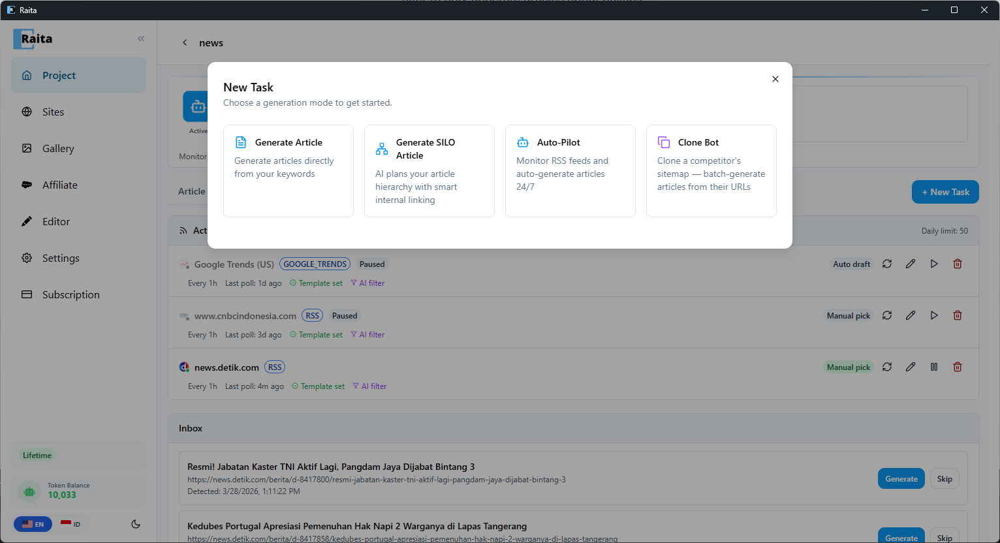
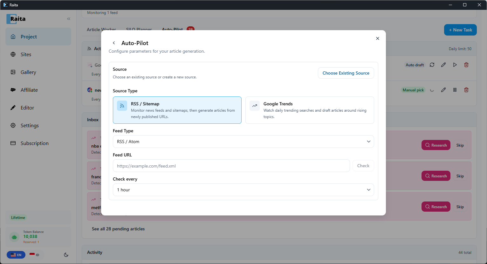
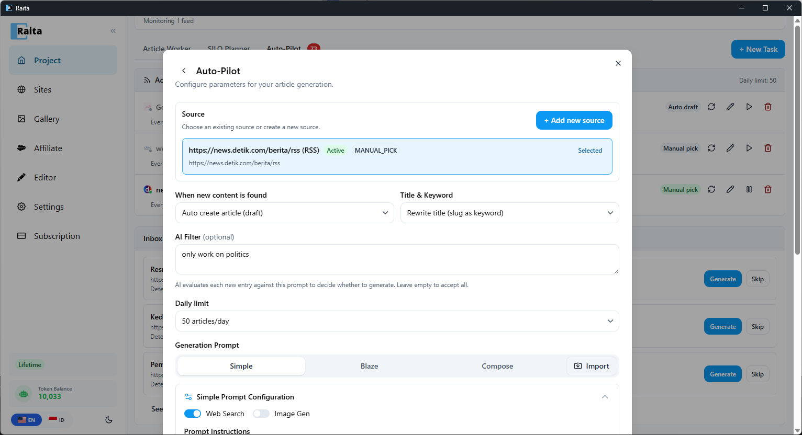

This guide walks you through setting up an automated content bot that monitors an RSS news feed, filters articles by your niche, and generates unique articles — all on auto-pilot.

We'll use **news.detik.com** as an example RSS source and set up an AI filter to only generate articles about politics.

---

## Step 1: Create a Project

If you haven't already, create a project for your auto bot. Go to **Project** in the sidebar and click **New Project**. Give it a name like "Politics News Bot".

---

## Step 2: Open Auto-Pilot

Inside your project, click **+ New Task** to open the task picker. Select **Auto-Pilot**.



---

## Step 3: Choose RSS / Sitemap Source

Under **Source Type**, select **RSS / Sitemap**.

Configure the feed:
- **Feed Type** — RSS / Atom
- **Feed URL** — `https://news.detik.com/berita/rss`
- Click **Check** to verify the feed is valid

Set the **Check every** interval — how often Raita polls for new articles (e.g. every 1 hour).



---

## Step 4: Set Behavior

- **When new content is found** — choose **Manual pick (review in inbox)** to review articles before generating, or **Auto create article (draft)** to generate automatically
- **Title & Keyword** — choose how to extract the article title (e.g. "Rewrite title (slug as keyword)")

---

## Step 5: Set AI Filter

This is where the magic happens. In the **AI Filter** field, enter a prompt that describes what articles to accept:

```
only work on politics
```

AI evaluates each new RSS entry against this prompt. Articles about politics will pass through; everything else (sports, entertainment, health news, etc.) gets filtered out and sent to the AI Filtered section.



---

## Step 6: Set Daily Limit

Choose a **Daily limit** to control how many articles are generated per day (e.g. 50 articles/day). This prevents runaway generation from high-volume feeds.

---

## Step 7: Choose a Prompt Template

Under **Generation Prompt**, pick a starter template:
- **Simple V4** *(Recommended)* — fast, single-pass generation with web search
- **Blaze V4** — multi-stage for longer articles
- **Compose V4** — section-based for full control

The source article's content and URL are automatically injected into the prompt, so the generated article will be based on the original news story.

---

## Step 8: Start the Bot

Click **Generate** to activate your auto bot. Raita will immediately poll the feed and start processing articles.

---

## Monitoring Your Bot

Your feed appears in the **Active Feeds** section of the Auto-Pilot tab. Below it you'll see:

### Inbox
Articles that pass the AI filter land here (if using Manual pick). Click **Generate** to create an article, or **Skip** to dismiss.


### Activity Log
All generated articles appear here with their source, time, and status. They also show up in the regular **Article Worker** tab.

### AI Filtered
Articles rejected by your filter appear here with the reason (e.g. "personal health news, not politics"). You can still click **Generate** to override the filter, or **Dismiss** to remove them.


---

## Next Steps

- Add more RSS feeds from different news sources to diversify your content
- Set up [Google Trends](../automation/google-trends.md) as an additional source for trending topic discovery
- Connect your [WordPress site](../publishing/wordpress.md) and switch to **Auto publish** to fully automate the pipeline
- Explore [Clone Bot](../automation/clone-bot.md) to clone a competitor's article list
